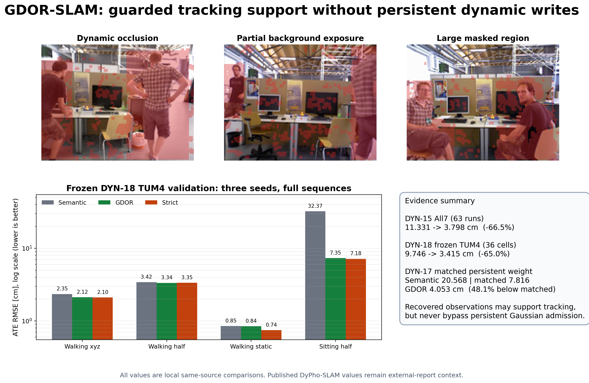

# GDOR-SLAM

Guarded Dynamic Observation Recovery for RGB-D Gaussian SLAM.

GDOR-SLAM is a research implementation for dynamic RGB-D scenes. It selectively
recovers dynamic-region observations that pass conservative temporal, geometric,
and camera-motion checks, while keeping dynamic evidence out of persistent
Gaussian map admission by default.



## Paper And Evidence

The public paper artifact is available in [`paper/`](paper/README.md):

- [9-page TMM pre-submission manuscript](paper/GDOR-SLAM_TMM_v5r3_preprint.pdf);
- [four paper figures](paper/figures/);
- [claim-bearing aggregate CSV files](paper/data/);
- [figure-generation and evidence-validation scripts](paper/scripts/);
- [public evidence manifest](paper/EVIDENCE_MANIFEST.md) and checksums.

The main same-source results are:

| Protocol | Comparison | Result |
| --- | --- | ---: |
| DYN-15, 63 runs | Semantic hard exclusion -> GDOR, All7 mean ATE | 11.331 -> **3.798 cm** |
| DYN-18, 36 cells | Semantic hard exclusion -> GDOR, TUM4 mean ATE | 9.746 -> **3.415 cm** |
| DYN-17, 9 runs | Map-matched control -> GDOR, subset mean ATE | 7.816 -> **4.053 cm** |
| DYN-16, 40 views | Semantic -> GDOR, static-region PSNR | 19.068 -> **20.154 dB** |

These are local same-source comparisons. They do not establish superiority over
an official, protocol-matched DyPho-SLAM rerun; see the evidence manifest for the
complete claim boundary.

## Method Boundary

The implementation separates transient tracking evidence from persistent mapping:

```text
dynamic observation
        |
        +--> guarded transient tracking recovery
        |
        +--> hard exclusion from persistent Gaussian mapping
```

The main components are:

1. **Selective recovery.** Temporal background support, RGB-D depth consistency,
   residual optical flow, and dynamic-region risk gates decide which excluded
   observations may be used.
2. **Guarded motion reasoning.** Camera-motion compensation and support checks
   reject independently moving pixels before recovery or pose-prior admission.
3. **Tracking/mapping decoupling.** Dynamic observations may affect the current
   transient camera estimate, but dynamic tracklets and object states are not
   automatically used for Gaussian initialization, update, densification, or
   persistent map writes.

The implementation and evidence boundary are described in
[`docs/METHOD.md`](docs/METHOD.md). Local comparison evidence is described in
[`docs/LOCAL_REPRODUCTION_SCOPE.md`](docs/LOCAL_REPRODUCTION_SCOPE.md).

## Repository Scope

This repository is a clean source release. It contains the GDOR implementation,
ORB-SLAM3 integration, CUDA Gaussian components, configuration presets, benchmark
scripts, and unit tests. It intentionally does not contain datasets, experiment
outputs, trajectory exports, Gaussian maps, TensorRT engines, or the binary
LibTorch distribution.

The code lineage includes DyPho-compatible engineering presets. These are local
reproductions of the available method structure, not the official DyPho-SLAM
implementation.

## Dependencies

The tested local toolchain used CUDA 11.8, LibTorch 2.0.1+cu118, OpenCV 4.7.0,
Eigen3, Sophus, GLFW, GLM, jsoncpp, TensorRT, and a C++17 compiler. Equivalent
newer versions may work but are not covered by the recorded local evidence.

Install the external dependencies and provide:

- `DYNAGS_LIBTORCH_ROOT`: external LibTorch installation;
- optionally `DYNAGS_OPENCV_DIR`: OpenCV CMake package directory;
- `ORB-SLAM3/Vocabulary/ORBvoc.txt`: ORB-SLAM3 vocabulary;
- `model/yolov8s.engine`: TensorRT YOLO engine when using YOLO-enabled presets.

The vocabulary, engine, datasets, and generated outputs are deliberately not
committed.

## Build

```bash
export DYNAGS_LIBTORCH_ROOT=/path/to/libtorch
export DYNAGS_OPENCV_DIR=/path/to/opencv/lib/cmake/opencv4
./build.sh
```

The build script first builds DBoW2, then ORB-SLAM3, then the GDOR Gaussian SLAM
targets and tests. To run the tests directly after building:

```bash
for test in bin/test_*; do
  LD_LIBRARY_PATH="$PWD/lib:$PWD/ORB-SLAM3/lib:${LD_LIBRARY_PATH:-}" "$test"
done
```

## Run A Sequence

`run_tum_dynamic.sh` accepts a dataset root through `DYNA_DATASETS_ROOT` and
refuses to reuse an existing output directory:

```bash
export DYNA_DATASETS_ROOT=/path/to/tum-rgbd-parent
./run_tum_dynamic.sh walking_xyz \
  --config dypho_flow_guarded \
  --seed 0 \
  --no-viewer \
  --no-realtime \
  --output-dir /path/to/new-output
```

For full multi-seed evaluation, use the reproducible runner:

```bash
python3 scripts/run_reproducible_benchmark.py \
  --configs dypho_compatible dypho_flow_guarded \
  --sequences tum_walking_xyz tum_walking_halfsphere bonn_person_tracking bonn_crowd3 \
  --seeds 0 1 2 \
  --gpus 0 \
  --jobs 1 \
  --heldout-stride 0 \
  --output-root /path/to/new-experiment-root
```

Each run records the command, source commit, source snapshot, configuration
hashes, trajectories, ATE/RPE metrics, tracking state, mapping counters, and
runtime information in its manifest.

## Evidence Boundary

The included public evidence supports a comparison against a clean
**DyPho-compatible local reproduction**. It does not establish superiority over
the official DyPho-SLAM implementation. Official paper numbers must remain
external-report context unless the official implementation is independently
rerun under a matched protocol.

The current research package is therefore suitable for reproducing the GDOR
mechanism and its local comparison, but paper claims must retain this distinction.

## License

See [`LICENSE`](LICENSE) and [`LICENSE.md`](LICENSE.md). Third-party components
retain their original licenses in their respective directories.
